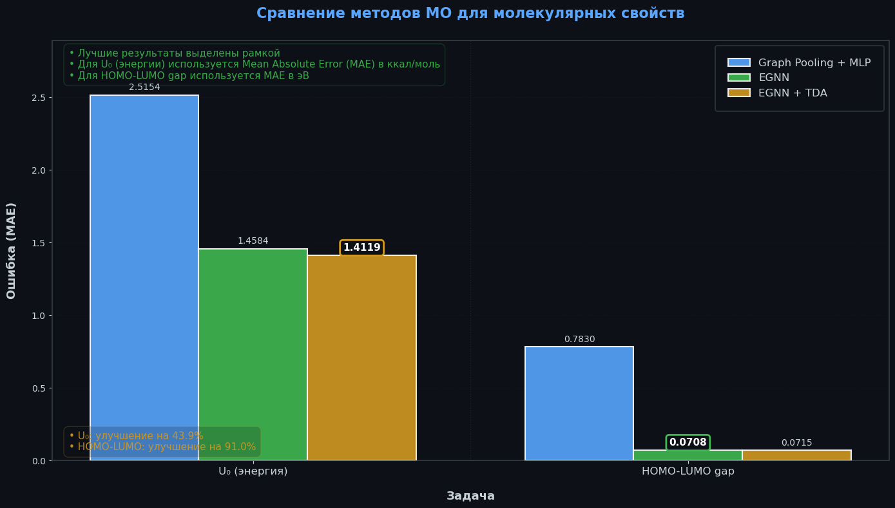
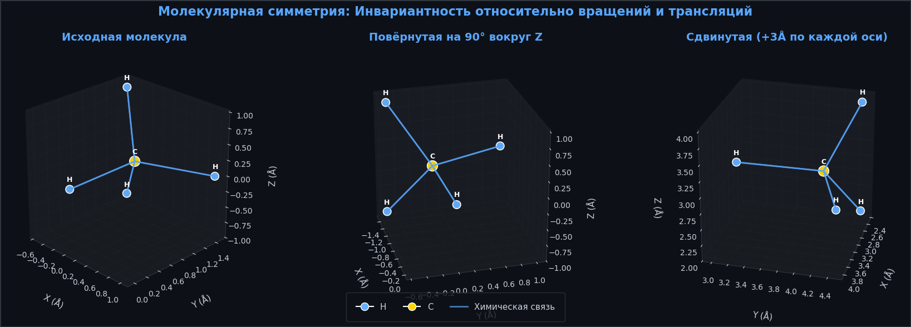
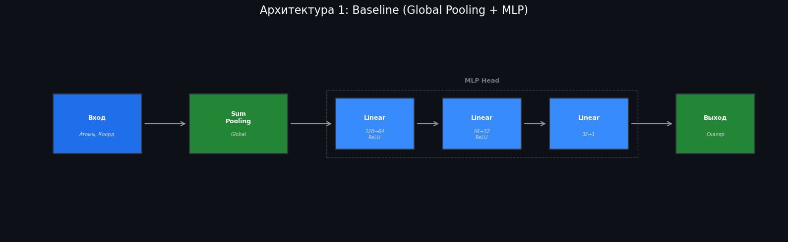
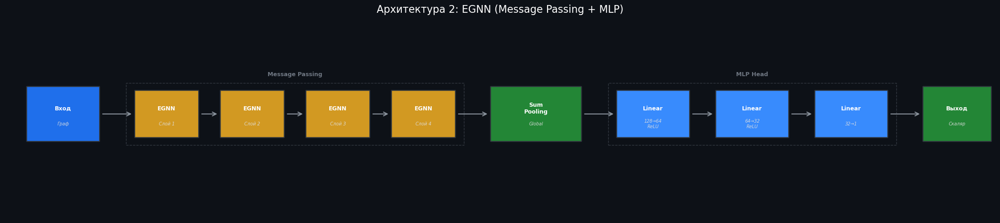
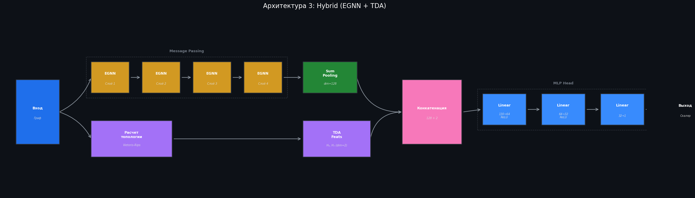

Применение геометрического машинного обучения и топологического анализа данных (TDA) для предсказания молекулярных свойств на датасете QM9. Реализован полный пайплайн: от вычисления топологических признаков (комплекс Вьеториса-Рипса) до обучения эквивариантных сетей (EGNN) с интеграцией глобальных топологических дескрипторов.

# 1. Краткое резюме

EGNN обеспечивает значительный прирост точности за счёт учёта симметрий молекул. Топологические признаки дают дополнительное улучшение для предсказания энергии.



Критерии выполнения:
- Программа минимум: реализован полный пайплайн, обучение, сравнительный анализ.
- Программа: добавлен модуль автоматической экстракции геометрических приоров для рекомендации использования TDA.

# 2. Научная мотивация

Стандартные полносвязные сети игнорируют геометрическую структуру молекул. При вращении или перестановке атомов молекула остаётся химически идентичной, но её вектор признаков в пространстве входов FCNN меняется произвольно. Это заставляет сеть заново учить одну и ту же химическую закономерность в разных ориентациях — расточительно и неустойчиво.

Молекулярные данные обладают тремя ключевыми симметриями:
- Трансляционная инвариантность: сдвиг всей молекулы не меняет её свойства
- Вращательная инвариантность (подгруппа SO(3)): вращение молекулы сохраняет химию
- Перестановочная инвариантность: порядок нумерации атомов произволен



EGNN кодирует эти симметрии в архитектуру, обеспечивая более высокую точность и устойчивость. TDA (комплекс Вьеториса–Рипса) добавляет глобальные топологические признаки, выявляя структурные образования (кольца, полости), что дополняет локальное описание EGNN.

# 3. Архитектура пайплайна

1. Загрузка и препроцессинг QM9. Загрузка датасета через torch_geometric.datasets.QM9. Целевые переменные (энергия U₀, HOMO-LUMO gap) нормализуются по среднему и стандартному отклонению, вычисленным только на тренировочной выборке. Данные разбиваются на трейн/валидацию/тест в пропорции 80/10/10 с фиксированным сидом.

2. Вычисление топологических признаков. Построение комплекса Вьеториса–Рипса (размерности 0,1) и расчёт персистентной энтропии.

3. Гибридная архитектура "EGNN + TDA" – стек из 4 слоёв EGNN с возможностью конкатенации TDA-признаков.

4. Автоматическая экстракция приоров – анализ вариативности локальной плотности для рекомендации использования TDA.

# 4. Экспериментальная часть

## Дизайн экспериментов

Выбраны два таргета из QM9:
- U₀ (внутренняя энергия, индекс 7) — экстенсивное свойство, зависящее от общей структуры молекулы
- HOMO-LUMO gap (индекс 4) — интенсивное свойство, определяемое локальной электронной структурой

Сравнивались 3 конфигурации:

- Graph Pooling + MLP: n_layers=0



- EGNN: 4 слоя эквивариантной сети без топологических признаков



- EGNN + TDA: 4 слоя EGNN + 2D вектор персистентной энтропии (гомологии размерностей 0 и 1)



Все эксперименты проведены с фиксированным сидом (42), батч-размером 256, оптимизатором Adam (lr=5e-4), 150 эпохами. Метрика качества — MAE на тестовой выборке (10% от датасета).

## Результаты

Тестовые MAE для всех конфигураций:

| Таргет       | Baseline FCNN | Base EGNN | Hybrid TDA |
|--------------|---------------|-----------|------------|
| U₀ (эВ)      | 2.5154        | 1.4584    | **1.4119** |
| Gap (эВ)     | 0.7830        | **0.0708**| 0.0715     |

Эквивариантная архитектура превосходит бейзлайн на порядок для обоих таргетов. Причина — явное кодирование симметрий (вращения, перестановки атомов) в архитектуру. FCNN вынуждена аппроксимировать инвариантность из данных, что требует экспоненциально больше примеров.

Топологические признаки дают скромный прирост (+3.2%) только для задачи предсказания энергии U₀. Это объяснимо: энергия зависит от глобальной структуры молекулы (кольца, разветвления), которые эффективно кодируются персистентными диаграммами. Для HOMO-LUMO gap глобальная топология неинформативна — свойство определяется локальной электронной конфигурацией, которую уже точно улавливает эквивариантная сеть.

## Экстракция приоров

Реализован алгоритм автоматической рекомендации использования TDA на основе геометрического приора — вариативности локальной плотности атомов в молекуле.

Метод:
- Для 1000 случайных молекул подсчитывается среднее число соседей в радиусе 2.3 ангстрем
- Вычисляется стандартное отклонение плотности по выборке
- Если σ > 0.7 — рекомендуется использовать TDA (высокая структурная вариативность требует глобального описания)

Результат для QM9: σ = 0.5755 → рекомендация: не использовать TDA. Это согласуется с экспериментами — для большинства молекул датасета структурная вариативность умеренная, и чистая EGNN уже достаточно эффективна. Прирост от TDA наблюдается только для подмножества молекул с аномальной топологией (макроциклы, кластеры).

# 5. Воспроизводимость

## Настройка окружения

Установка виртуального окружения:
```bash
conda create -f environment.yml
```

## Эксплуатация

1. Скачивание данных и препроцессинг
```bash
python preprocess.py
# Автоматически загрузит QM9 в ./data и сохранит TDA-признаки в ./data/tda_features.pt
```

2. Обучение моделей
```bash
# Baseline FCNN (без эквивариантных слоёв)
python train.py --target_idx 7 --n_layers 0 --epochs 150

# Base EGNN (4 эквивариантных слоя)
python train.py --target_idx 7 --n_layers 4 --epochs 150

# Hybrid TDA (EGNN + топологические признаки)
python train.py --target_idx 7 --n_layers 4 --use_tda --epochs 150
```

3. Генерация предсказаний
```bash
python predict.py \
  --model_path models/U0_Hybrid_TDA_seed42.pth \
  --target_idx 7 \
  --n_layers 4 \
  --use_tda \
  --output predictions.csv
```

## Ключевые эксперименты для воспроизведения

| Эксперимент        | Команда                                                                 |
|--------------------|-------------------------------------------------------------------------|
| U₀ Baseline        | `python train.py --target_idx 7 --n_layers 0 --seed 42`                |
| U₀ Base EGNN       | `python train.py --target_idx 7 --n_layers 4 --seed 42`                |
| U₀ Hybrid TDA      | `python train.py --target_idx 7 --n_layers 4 --use_tda --seed 42`      |
| Gap Baseline       | `python train.py --target_idx 4 --n_layers 0 --seed 42`                |
| Gap Base EGNN      | `python train.py --target_idx 4 --n_layers 4 --seed 42`                |
| Gap Hybrid TDA     | `python train.py --target_idx 4 --n_layers 4 --use_tda --seed 42`      |

## Трекинг экспериментов

Все эксперименты автоматически логируются в MLflow. Для просмотра результатов:

```bash
mlflow ui
```

Результаты сохраняются в локальную базу `mlflow.db` и директорию `mlruns/`. Каждый запуск содержит:
- Все гиперпараметры (архитектура, использование TDA, seed)
- Метрики по эпохам (train/val MAE)
- Финальную метрику на тесте
- Сохранённые веса модели

Для воспроизведения любого эксперимента достаточно указать тот же `--seed` и набор гиперпараметров. Случайность контролируется через `seed_everything()` в `src/utils.py`.

# 6. Обсуждение и выводы

Выводы:

- Явное кодирование симметрий в EGNN даёт порядковое улучшение точности.
- TDA эффективен избирательно: полезен для глобальных свойств (энергия), но не для локальных (HOMO-LUMO gap).
- Алгоритм рекомендации TDA на основе геометрических приоров работает корректно для QM9.

Ограничения и развитие:

- TDA в размерностях (0,1) может быть недостаточен для сложных структур.
- Перспективы: использование полных персистентных диаграмм, учёт хиральности, интеграция с физическими моделями, применение к белковым структурам.